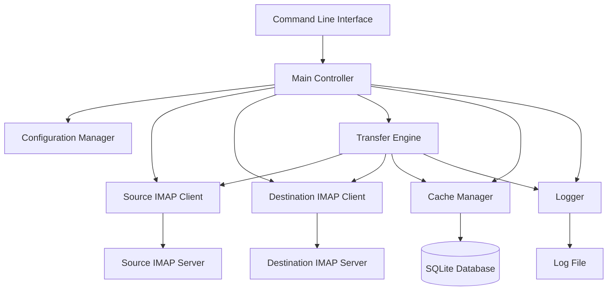
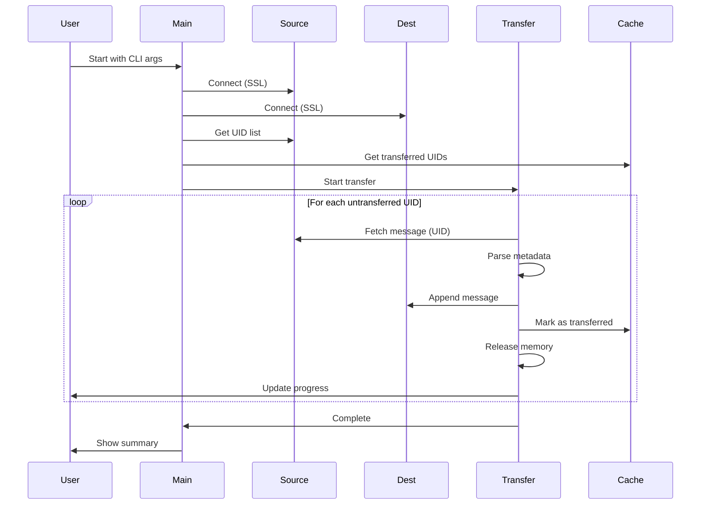

# Design Document

## Overview

IMAP Mail Transfer Tool, Python 3.8+ kullanarak iki IMAP sunucu arasında e-posta transferi yapan bir command-line uygulamasıdır. Temel tasarım prensibi, Thunderbird'ün kullandığı streaming yaklaşımını benimseyerek her seferinde yalnızca bir mesajı belleğe almak ve işledikten sonra serbest bırakmaktır. Bu yaklaşım, büyük miktarda e-posta transferinde bile sabit RAM kullanımı (~100-200MB) sağlar.

Uygulama, modüler bir yapıya sahiptir ve her modül belirli bir sorumluluğu üstlenir. SQLite tabanlı cache sistemi sayesinde duplicate kontrolü ve resume desteği sağlanır. Hata yönetimi, retry mekanizması ve detaylı loglama ile güvenilir bir transfer süreci garanti edilir.

## Architecture

### High-Level Architecture



### Component Interaction Flow



## Components and Interfaces

### 1. Main Controller (main.py)

**Responsibility:** Uygulamanın giriş noktası ve orkestrasyon

**Interface:**
```python
def main() -> int:
    """
    Ana program akışı
    Returns: Exit code (0 = success, 1 = error)
    """
    pass

def parse_arguments() -> argparse.Namespace:
    """
    CLI argümanlarını parse eder
    Returns: Parsed arguments
    """
    pass

def setup_logging(log_file: str) -> logging.Logger:
    """
    Logging sistemini yapılandırır
    Args:
        log_file: Log dosyası yolu
    Returns: Logger instance
    """
    pass
```

**Design Decisions:**
- argparse kullanarak CLI argümanları yönetilir
- Tüm bileşenler main controller tarafından başlatılır ve koordine edilir
- Graceful shutdown için signal handling eklenir

### 2. IMAP Client (imap_client.py)

**Responsibility:** IMAP sunucu bağlantıları ve operasyonları

**Interface:**
```python
class IMAPClient:
    def __init__(self, host: str, username: str, password: str, port: int = 993):
        """
        IMAP client oluşturur
        Args:
            host: IMAP sunucu adresi
            username: Kullanıcı adı
            password: Şifre
            port: IMAP port (default: 993 for SSL)
        """
        pass
    
    def connect(self) -> bool:
        """
        SSL bağlantısı kurar
        Returns: True if successful
        Raises: IMAPConnectionError
        """
        pass
    
    def disconnect(self) -> None:
        """
        Bağlantıyı kapatır
        """
        pass
    
    def select_folder(self, folder: str) -> int:
        """
        Klasör seçer
        Args:
            folder: Klasör adı
        Returns: Klasördeki mesaj sayısı
        Raises: IMAPFolderError
        """
        pass
    
    def get_uid_list(self) -> List[str]:
        """
        Seçili klasördeki tüm UID'leri getirir
        Returns: UID listesi
        """
        pass
    
    def fetch_message(self, uid: str) -> Tuple[bytes, str, List[str]]:
        """
        Tek bir mesajı getirir (streaming)
        Args:
            uid: Message UID
        Returns: (message_data, date, flags)
        Raises: IMAPFetchError
        """
        pass
    
    def append_message(self, folder: str, message_data: bytes, 
                      date: str, flags: List[str]) -> str:
        """
        Mesajı hedef klasöre ekler
        Args:
            folder: Hedef klasör
            message_data: RFC822 mesaj verisi
            date: Mesaj tarihi
            flags: Mesaj flags
        Returns: Yeni UID
        Raises: IMAPAppendError
        """
        pass
    
    def create_folder(self, folder: str) -> bool:
        """
        Klasör oluşturur (yoksa)
        Args:
            folder: Klasör adı
        Returns: True if created or exists
        """
        pass
    
    def folder_exists(self, folder: str) -> bool:
        """
        Klasörün varlığını kontrol eder
        Args:
            folder: Klasör adı
        Returns: True if exists
        """
        pass
```

**Design Decisions:**
- Python'un built-in `imaplib.IMAP4_SSL` kullanılır
- Her operasyon için özel exception sınıfları tanımlanır
- Connection pooling yerine tek bağlantı kullanılır (basitlik için)
- Timeout değerleri yapılandırılabilir olur

### 3. Transfer Engine (transfer.py)

**Responsibility:** Mesaj transfer mantığı ve streaming kontrolü

**Interface:**
```python
class TransferEngine:
    def __init__(self, source_client: IMAPClient, dest_client: IMAPClient,
                 cache_manager: CacheManager, logger: logging.Logger):
        """
        Transfer engine oluşturur
        Args:
            source_client: Kaynak IMAP client
            dest_client: Hedef IMAP client
            cache_manager: Cache yöneticisi
            logger: Logger instance
        """
        pass
    
    def transfer_folder(self, folder: str) -> TransferResult:
        """
        Klasördeki tüm mesajları transfer eder
        Args:
            folder: Transfer edilecek klasör
        Returns: Transfer sonuç istatistikleri
        """
        pass
    
    def _get_untransferred_uids(self, source_uids: List[str], 
                                folder: str) -> List[str]:
        """
        Transfer edilmemiş UID'leri belirler
        Args:
            source_uids: Kaynak sunucudaki UID'ler
            folder: Klasör adı
        Returns: Transfer edilecek UID listesi
        """
        pass
    
    def _transfer_single_message(self, uid: str, folder: str) -> bool:
        """
        Tek bir mesajı transfer eder (streaming)
        Args:
            uid: Mesaj UID
            folder: Klasör adı
        Returns: True if successful
        """
        pass
    
    def _cleanup_message(self) -> None:
        """
        Mesaj verisini bellekten temizler
        """
        pass
    
    def _update_progress(self, current: int, total: int) -> None:
        """
        İlerleme göstergesini günceller
        Args:
            current: Mevcut mesaj numarası
            total: Toplam mesaj sayısı
        """
        pass
```

**Design Decisions:**
- Her mesaj transfer edildikten sonra `gc.collect()` çağrılır
- Progress bar için `tqdm` kütüphanesi kullanılır
- Retry mekanizması exponential backoff ile uygulanır
- Her mesaj transfer sonrası cache güncellenir (crash safety)

### 4. Cache Manager (cache.py)

**Responsibility:** SQLite veritabanı yönetimi ve duplicate kontrolü

**Interface:**
```python
class CacheManager:
    def __init__(self, db_path: str = "transfer_cache.db"):
        """
        Cache manager oluşturur
        Args:
            db_path: SQLite veritabanı dosya yolu
        """
        pass
    
    def initialize(self) -> None:
        """
        Veritabanını oluşturur (yoksa)
        """
        pass
    
    def is_transferred(self, source_uid: str, folder: str) -> bool:
        """
        Mesajın daha önce transfer edilip edilmediğini kontrol eder
        Args:
            source_uid: Kaynak mesaj UID
            folder: Klasör adı
        Returns: True if already transferred
        """
        pass
    
    def mark_transferred(self, source_uid: str, dest_uid: str, 
                        folder: str) -> None:
        """
        Mesajı transfer edildi olarak işaretler
        Args:
            source_uid: Kaynak mesaj UID
            dest_uid: Hedef mesaj UID
            folder: Klasör adı
        """
        pass
    
    def get_transferred_uids(self, folder: str) -> List[str]:
        """
        Klasör için transfer edilmiş UID'leri getirir
        Args:
            folder: Klasör adı
        Returns: Transfer edilmiş UID listesi
        """
        pass
    
    def get_statistics(self, folder: str = None) -> Dict[str, int]:
        """
        Transfer istatistiklerini getirir
        Args:
            folder: Klasör adı (None = tüm klasörler)
        Returns: İstatistik dictionary
        """
        pass
    
    def close(self) -> None:
        """
        Veritabanı bağlantısını kapatır
        """
        pass
```

**Design Decisions:**
- SQLite3 kullanılır (Python built-in)
- Her transfer sonrası commit yapılır (data loss prevention)
- Composite primary key: (source_uid, folder)
- Index eklenir: folder üzerinde hızlı sorgulama için

### 5. Configuration Manager (config.py)

**Responsibility:** Yapılandırma yönetimi ve validasyon

**Interface:**
```python
@dataclass
class TransferConfig:
    """Transfer yapılandırması"""
    source_host: str
    source_user: str
    source_pass: str
    dest_host: str
    dest_user: str
    dest_pass: str
    folder: str
    port: int = 993
    timeout: int = 60
    retry_count: int = 3
    retry_delay: int = 5
    log_file: str = "transfer.log"
    cache_db: str = "transfer_cache.db"
    max_message_size: int = 52428800  # 50MB

def load_config_from_args(args: argparse.Namespace) -> TransferConfig:
    """
    CLI argümanlarından config oluşturur
    Args:
        args: Parsed arguments
    Returns: TransferConfig instance
    Raises: ConfigValidationError
    """
    pass

def validate_config(config: TransferConfig) -> bool:
    """
    Config'i validate eder
    Args:
        config: TransferConfig instance
    Returns: True if valid
    Raises: ConfigValidationError
    """
    pass
```

**Design Decisions:**
- Python dataclass kullanılır (type safety)
- Tüm parametreler validate edilir
- Şifreler environment variable'dan da okunabilir (güvenlik)
- Sensible defaults sağlanır

### 6. Utilities (utils.py)

**Responsibility:** Yardımcı fonksiyonlar

**Interface:**
```python
def format_size(bytes: int) -> str:
    """
    Byte'ı human-readable formata çevirir
    Args:
        bytes: Byte sayısı
    Returns: Formatted string (e.g., "1.5 MB")
    """
    pass

def parse_imap_date(date_str: str) -> str:
    """
    IMAP tarih formatını parse eder
    Args:
        date_str: IMAP tarih string
    Returns: Normalized date string
    """
    pass

def sanitize_folder_name(folder: str) -> str:
    """
    Klasör adını sanitize eder
    Args:
        folder: Raw folder name
    Returns: Sanitized folder name
    """
    pass

class RetryHandler:
    """Retry mekanizması için helper class"""
    def __init__(self, max_retries: int, delay: int):
        pass
    
    def execute(self, func: Callable, *args, **kwargs) -> Any:
        """
        Fonksiyonu retry ile çalıştırır
        """
        pass
```

## Data Models

### SQLite Schema

```sql
CREATE TABLE IF NOT EXISTS transferred_messages (
    source_uid TEXT NOT NULL,
    dest_uid TEXT NOT NULL,
    folder TEXT NOT NULL,
    transferred_at TIMESTAMP DEFAULT CURRENT_TIMESTAMP,
    message_size INTEGER,
    PRIMARY KEY (source_uid, folder)
);

CREATE INDEX IF NOT EXISTS idx_folder ON transferred_messages(folder);
CREATE INDEX IF NOT EXISTS idx_transferred_at ON transferred_messages(transferred_at);
```

### Transfer Result Model

```python
@dataclass
class TransferResult:
    """Transfer sonuç istatistikleri"""
    total_messages: int
    transferred: int
    skipped: int
    failed: int
    total_size: int
    duration_seconds: float
    errors: List[str]
```

### Custom Exceptions

```python
class IMAPTransferError(Exception):
    """Base exception"""
    pass

class IMAPConnectionError(IMAPTransferError):
    """Bağlantı hataları"""
    pass

class IMAPFolderError(IMAPTransferError):
    """Klasör hataları"""
    pass

class IMAPFetchError(IMAPTransferError):
    """Mesaj fetch hataları"""
    pass

class IMAPAppendError(IMAPTransferError):
    """Mesaj append hataları"""
    pass

class ConfigValidationError(IMAPTransferError):
    """Config validation hataları"""
    pass
```

## Error Handling

### Error Handling Strategy

1. **Network Errors:**
   - Retry up to 3 times with exponential backoff
   - Log each retry attempt
   - If all retries fail, log error and continue with next message

2. **Message Too Large:**
   - Check message size before transfer
   - Skip if exceeds max_message_size (50MB default)
   - Log skipped message with size info

3. **Authentication Errors:**
   - Fail fast - terminate program
   - Log detailed error message
   - Return non-zero exit code

4. **Folder Not Found:**
   - On source: Log error and terminate
   - On destination: Create folder automatically

5. **Unrecoverable Errors:**
   - Log full stack trace
   - Continue with next message
   - Include in final error summary

### Logging Strategy

```python
# Log levels:
# DEBUG: Detailed IMAP commands and responses
# INFO: Progress updates, successful transfers
# WARNING: Retries, skipped messages
# ERROR: Failed transfers, connection issues
# CRITICAL: Fatal errors requiring termination

# Log format:
# [TIMESTAMP] [LEVEL] [COMPONENT] Message
# Example: [2025-11-05 10:30:45] [INFO] [TransferEngine] Transferred message UID 12345
```

## Testing Strategy

### Unit Tests

1. **IMAPClient Tests:**
   - Mock imaplib responses
   - Test connection handling
   - Test UID fetching
   - Test message fetch/append
   - Test error scenarios

2. **CacheManager Tests:**
   - Test database initialization
   - Test duplicate detection
   - Test mark_transferred
   - Test statistics

3. **TransferEngine Tests:**
   - Mock IMAPClient and CacheManager
   - Test transfer flow
   - Test progress tracking
   - Test error handling and retries

4. **Config Tests:**
   - Test validation logic
   - Test default values
   - Test error cases

### Integration Tests

1. **End-to-End Transfer:**
   - Use test IMAP servers (or mock servers)
   - Transfer small set of messages
   - Verify all messages transferred
   - Verify metadata preserved

2. **Resume Test:**
   - Start transfer
   - Interrupt mid-way
   - Restart and verify resume

3. **Memory Test:**
   - Transfer large number of messages
   - Monitor RAM usage
   - Verify stays under 200MB

### Performance Tests

1. **Throughput Test:**
   - Measure messages per second
   - Test with various message sizes
   - Identify bottlenecks

2. **Memory Leak Test:**
   - Run extended transfer (10,000+ messages)
   - Monitor memory over time
   - Verify no memory growth

## Memory Management

### Streaming Implementation

```python
# Pseudo-code for streaming transfer
def _transfer_single_message(self, uid: str, folder: str) -> bool:
    try:
        # 1. Fetch only this message (not all messages)
        message_data, date, flags = self.source_client.fetch_message(uid)
        
        # 2. Immediately append to destination
        dest_uid = self.dest_client.append_message(folder, message_data, date, flags)
        
        # 3. Mark as transferred
        self.cache_manager.mark_transferred(uid, dest_uid, folder)
        
        # 4. Explicitly release memory
        del message_data
        gc.collect()
        
        return True
    except Exception as e:
        # Handle error
        pass
```

### Memory Optimization Techniques

1. **No Bulk Loading:** UID listesi dışında hiçbir şey toplu olarak yüklenmez
2. **Immediate Processing:** Her mesaj fetch edilir edilmez işlenir
3. **Explicit Cleanup:** Her mesaj sonrası `del` ve `gc.collect()`
4. **Generator Usage:** Büyük listeler yerine generator kullanımı
5. **Connection Reuse:** Her mesaj için yeni bağlantı açılmaz

## Security Considerations

1. **Credential Handling:**
   - Şifreler command-line'da görünmez (environment variables)
   - Şifreler log dosyasına yazılmaz
   - Şifreler cache'e yazılmaz

2. **SSL/TLS:**
   - Tüm bağlantılar SSL üzerinden
   - Certificate validation aktif
   - Minimum TLS 1.2

3. **File Permissions:**
   - Cache database: 600 (owner read/write only)
   - Log file: 600 (owner read/write only)

4. **Input Validation:**
   - Tüm user input validate edilir
   - SQL injection prevention (parameterized queries)
   - Path traversal prevention

## Deployment

### Requirements

```
Python 3.8+
Dependencies:
- tqdm (progress bar)
- Standard library: imaplib, sqlite3, argparse, logging, gc
```

### Installation

```bash
# Clone repository
git clone <repo-url>
cd imap-mail-transfer

# Install dependencies
pip install -r requirements.txt

# Run
python main.py --help
```

### Usage Example

```bash
python main.py \
  --source-host imap.yandex.com.tr \
  --source-user user@domain.com \
  --source-pass $SOURCE_PASS \
  --dest-host imap.connect365.com.tr \
  --dest-user user@domain.com \
  --dest-pass $DEST_PASS \
  --folder INBOX
```

## Future Enhancements

1. **Parallel Transfer:** 3-4 mesaj paralel transfer (threading)
2. **Web UI:** Flask/FastAPI ile progress monitoring
3. **Email Notification:** Transfer tamamlandığında bildirim
4. **Folder Sync:** Tüm klasörleri otomatik sync
5. **Incremental Sync:** Periyodik sync için daemon mode
6. **Compression:** Büyük mesajlar için compression
7. **Bandwidth Throttling:** Network kullanımını sınırlama
